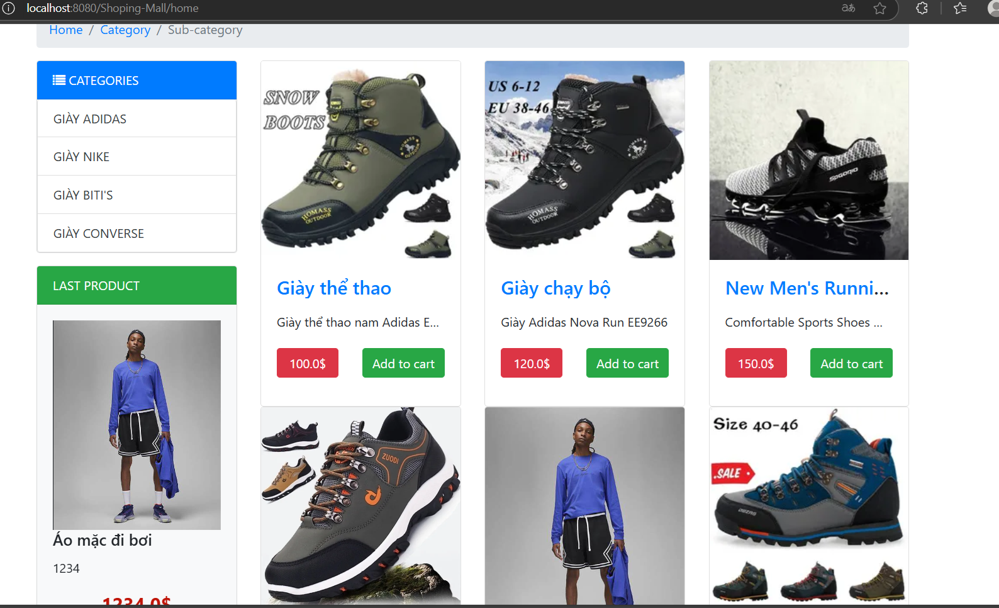

# Welcome to Shoping-Mall Repository that used JSP and Servlet 
### You will find in this repo the following stuff:
* CRUD a product
* Use JDBC to connect to SQLserver database
* 4 package: context, dao, control, entity. Each package do it's task. 
* Context is a package Connection have an Object make connect to SQLserver
* DAO is a package that Class hava to get the data in the database
* Entity is a package that is DTO. Insatanse of Object
* Control have more servlet that get data in database and push data in to right jsp
* ...

#### © 2024 ji-Ly
